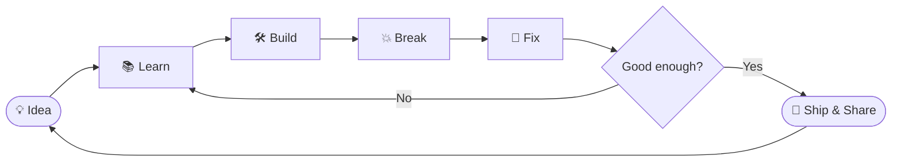

<div align="center">


<a href="https://github.com/JayrajJagdale">
  
</a>

<br/>


</div>

---

## 🖥️ My Desktop

```text
┌─────────────────────────────────────────────────────────────┐
│  🪟 Jayraj's Workspace                          ─  □  ✕     │
├─────────────────────────────────────────────────────────────┤
│                                                             │
│   📱 Flutter          🧩 DSA            💻 Projects         │
│                                                             │
│   📂 Learning         🔧 Git/GitHub     🎯 Placements       │
│                                                             │
│   🧠 Problem Solving  🚀 Building       📚 Consistency      │
│                                                             │
└─────────────────────────────────────────────────────────────┘
```

I'm a **3rd-year B.Tech student in Computer Science & Business Systems** at **KIT**, learning by building.

**Current focus:** `Flutter + Dart` → `DSA` → `Projects` → `Placement Preparation`

---

## 📂 Opening: `About_Me.exe`

```yaml
name: Jayraj Jagdale
education: B.Tech CSBS
college: KIT
graduation: 2028

currently_learning:
  - Flutter
  - Dart
  - Data Structures & Algorithms
  - Mobile App Development
  - Git & GitHub

current_goal:
  - Become a strong software developer
  - Build real-world applications
  - Prepare for software placements

philosophy: "Learn → Build → Break → Fix → Repeat"
```

---

## 🔄 My Workflow (it's a loop, not a line)



---

## 📊 Task Manager

```text
 Process               Status       Progress
 ───────────────────────────────────────────────────────
 flutter.exe           Running      ████████░░  80%
 dsa_grind.exe         Running      ██████░░░░  60%
 git_github.exe        Running      ███████░░░  70%
 projects.exe          Building     █████░░░░░  50%
 placement_prep.exe    Loading...   ████░░░░░░  40%
 consistency.exe       Always on    ██████████  ∞
```

> 📝 Edit the bars above anytime to match your real progress.

---

## 📱 Running: `flutter.exe`

```text
> flutter create my_next_project
> flutter run

✓ Learning UI
✓ Understanding widgets
✓ Exploring state management
✓ Building practical apps
✓ Improving one project at a time
```

---

## 🛠️ My Toolbox

<p align="left">
  
</p>

---

## 📈 GitHub Stats

<div align="center">


<br/>


</div>

---

## 🧩 LeetCode Progress

<div align="center">

<a href="https://leetcode.com/u/JAYRAJ_JAGDALE">
  
</a>

</div>

---

## 🐍 Contribution Snake

<div align="center">

<picture>
  <source media="(prefers-color-scheme: dark)" srcset="https://raw.githubusercontent.com/JayrajJagdale/JayrajJagdale/output/github-snake-dark.svg" />
  <source media="(prefers-color-scheme: light)" srcset="https://raw.githubusercontent.com/JayrajJagdale/JayrajJagdale/output/github-snake.svg" />
  
</picture>

</div>

---

## 🎮 Hidden Files

<details>
<summary><b>📁 Click to open <code>secret_terminal.sh</code></b></summary>

```bash
$ whoami
jayraj

$ cat goals.txt
1. Crack placements at top companies
2. Ship apps people actually use
3. Never stop learning

$ ./motivation.sh
"Consistency beats intensity."
Process exited with code 0 ✅
```

</details>

<details>
<summary><b>🧪 Click to see today's mission</b></summary>

- [ ] Solve at least 1 DSA problem
- [ ] Write some Flutter code
- [ ] Push a commit
- [ ] Learn one new thing

</details>

---

## 🌐 Connect With Me

<div align="center">

<a href="https://www.linkedin.com/in/jayrajjagdale">
  
</a>
<a href="https://github.com/JayrajJagdale">
  
</a>
<a href="https://leetcode.com/u/JAYRAJ_JAGDALE">
  
</a>
<a href="mailto:work.jayrajjagdale@gmail.com">
  
</a>
<!-- Add Instagram by uncommenting and replacing YOUR_HANDLE:
<a href="https://instagram.com/YOUR_HANDLE">
  
</a>
-->

</div>

---

<div align="center">

### `> Shutting down... see you at the next commit 👋`


</div>
